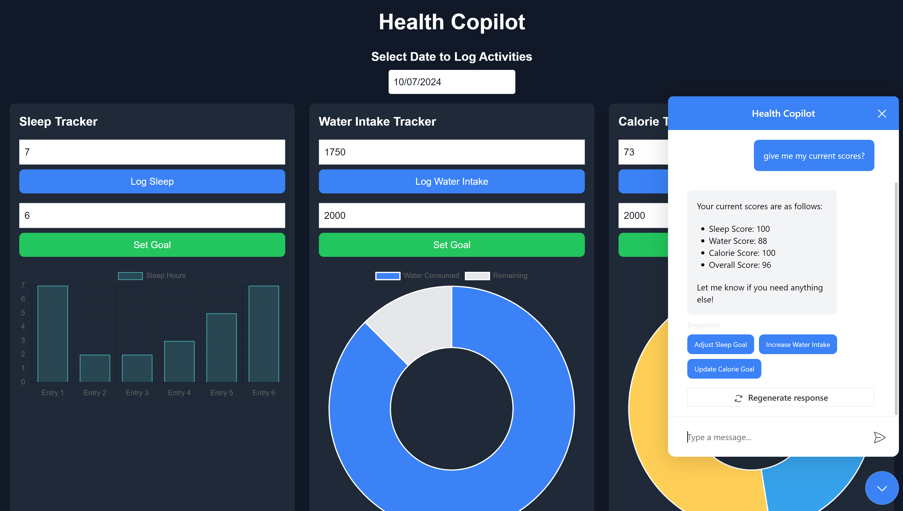

# Health Copilot

## Overview
Health Copilot is an AI-powered health tracking application built with Copilotkit, Next.js and React. It helps users monitor their daily sleep, water intake, and calorie consumption, providing visual feedback and personalized AI assistance.



## Features
- **Daily Activity Logging**: Track sleep, water intake, and calorie consumption.
- **Goal Setting**: Set personalized goals for each health metric.
- **Visual Data Representation**: View your progress through interactive charts.
- **AI-Powered Assistance**: Get personalized suggestions and insights from an AI copilot.
- **Progress Tracking**: Monitor your overall health score and view trends over time.
- **Responsive Design**: Fully functional on both desktop and mobile devices.

## Technology Stack
- Next.js
- React
- Chart.js
- Tailwind CSS
- CopilotKit for AI integration
- LocalStorage for data persistence

## Getting Started
1. Clone the repository
      ```
   git clone https://github.com/avaxia888/health_tracking_copilot.git
   ```
3. In the project root install dependencies:
   ```
   npm install
   ```
4. Run the development server:
   ```
   npm run dev
   ```
5. Open [http://localhost:3000](http://localhost:3000) in your browser

## Usage
- Select a date to log your activities
- Set goals for sleep, water intake, and calorie consumption
- Log your daily progress for each metric
- View your overall health score and individual metric scores
- Use the date range selector to view trends over time
- Interact with the AI copilot for personalized assistance

## Contributing
Contributions are welcome! Please feel free to submit a Pull Request.

## License
[MIT License](LICENSE)
